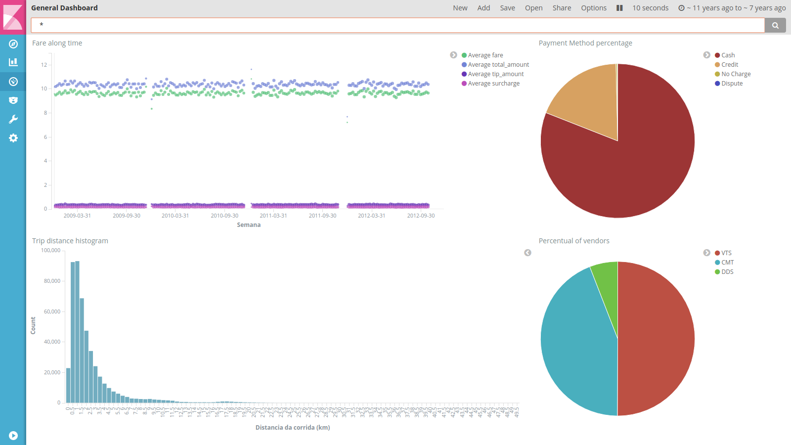

# AWS Stream | Kinesis - Elasticsearch 

Repositório contêm código que provisiona uma arquitetura para ingestão de dados em Stream. 

## Overview da arquitetura


O Kinesis Data Stream recebe dados produzidos pelos clientes (no exemplo utilizado, dados de corridas de Taxi).

Esses dados são consumidos pelo Kinesis Firehose, que os transforma utilizando uma função Lambda, realizando um backup dos dados brutos num bucket S3 e enviando os dados transformados para um cluster do Elasticsearch.

O IAM é utilizado para gerenciar permissões de cada um dos componentes da aplicação.

A infraestrutura foi provisionada a partir de uma instancia EC2 com as credenciais de uma conta da AWS e o Terraform instalado.

## Visualizações no Kibana

Importando o arquivo `resources/dashboard.json` na instancia do Kibana provisionada, será possivel visualizar o Dashboad a seguir (após a ingestão dos dados, é claro).



## Provisionando

Em uma máquina com as credenciais da AWS devidamente exportadas no bash e o Terraform instalado (e incluído no path) rodar os seguintes comandos na raíz desse repositório.

```bash
terraform init
terraform apply
```

## Função de transformação do Firehose (Lambda)

A função lambda utilizada para a transformação dos dados na Stream está na pasta `function/` e no arquivo `function.zip`.

O código realiza uma transformação Lookup (De/Para) em um campo, organiza alguns nomes e exclui varíaveis vazias em todo o dataset.

## Melhorias futuras

- Deixar permissões do IAM mais específicas (conceder permissões minimas necessárias).

- Incluir aplicação de analise de dados em Stream utilizando Kinesis Data Analytics para extração de métricas em tempo real.

- Encapsular algumas unidades básicas em módulos e expor com parâmetros.
